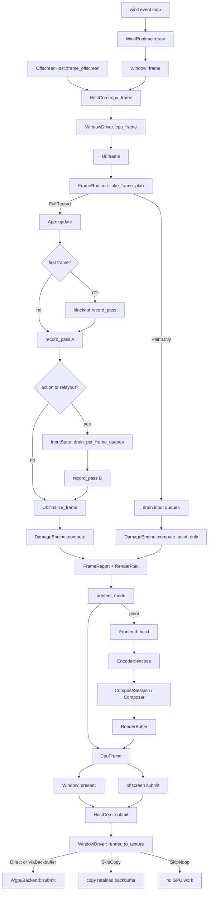
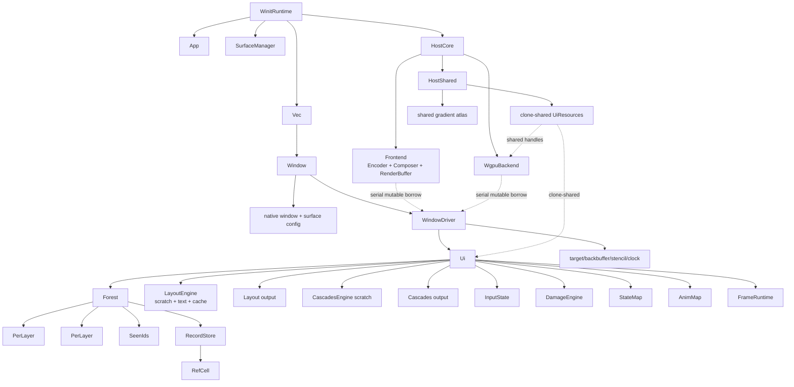

# Palantir call graph, ownership, and simplification analysis

Analyzed at `7c83422b` on 2026-07-29.

Scope: `palantir/src`, including the winit and offscreen hosts, immediate-mode
recording, layout, cascade, input, damage, CPU rendering, and wgpu submission.
The crate currently contains 371 Rust files and about 100,000 Rust source
lines, including tests and documentation.

Primary source anchors:

| Area | Entry point / owner |
|---|---|
| winit host | `src/host/winit/runtime.rs:126`, `src/host/winit/window.rs:75` |
| target-independent window driver | `src/host/window_driver.rs:41`, `:324`, `:425` |
| frame lifecycle | `src/ui/mod.rs:170`, `:343`, `:391`, `:432` |
| frame classification | `src/ui/frame.rs:95`, `:211` |
| recording | `src/scene/mod.rs:34`, `:81`, `:144` |
| payload ownership | `src/scene/record_store.rs:113` |
| layout | `src/layout/engine.rs:201`, `:566` |
| cascade | `src/scene/cascade/mod.rs:332`, `:479`, `:490` |
| input | `src/input/mod.rs:236`, `:399`, `:575`, `:884` |
| damage | `src/scene/damage/mod.rs:88`, `:293`, `:729` |
| frontend | `src/renderer/frontend/mod.rs:76`, `:99` |
| backend | `src/renderer/backend/mod.rs:393` |
| widget recording token | `src/widgets/mod.rs:72`, `:77` |

## Executive assessment

Palantir's central architecture is already coherent and deliberately
data-oriented:

- one retained arena tree per paint layer;
- recording-only scratch kept off the finalized tree;
- separate measure, arrange, cascade, damage, encode, compose, and submit
  phases;
- dense SoA columns and sparse side tables selected by downstream access
  pattern;
- retained scratch and output buffers that preserve allocation-free steady
  state;
- a single CPU frontend and GPU backend reused serially across window-owned
  render streams.

The profitable simplifications are consequently not broad subsystem mergers.
They are places where one fact is represented by several adjacent fields or
where runtime borrow machinery stands in for exclusivity the ownership graph
already guarantees.

The main recommendations, in priority order, are:

1. Collapse `RecordStore` and `RecordPayloads`, removing the outer
   `RefCell<RecordPayloads>`.
2. Make `Widget` a genuinely linear recording token and fold
   `WidgetEntry::record` plus response construction into one operation.
3. Move the full-frame cascade reuse fingerprint from `FrameRuntime` into the
   cascade subsystem.
4. Replace `WindowDriver`'s `output_valid` and `backbuffer_fresh` booleans
   with one presentation-state enum.
5. Replace the two sticky input-arrival booleans with one monotonic input
   activity state and pass only the resulting record decision to
   `FrameRuntime`.
6. Make layout-cache hits opaque handles instead of expanding one snapshot
   into a wide bundle of parallel slices.

These changes preserve the arena layout, static dispatch, zero-copy payload
spans, and allocation-free warm path.

## Runtime call graph

### Host, frame, and rendering path



`WindowDriver::cpu_frame` is the phase boundary between window-owned retained
state and host-shared CPU scratch. It runs `Ui::frame`, seals a `PresentMode`,
and builds the draw list only when that mode paints. This is important:
promotion of a partial plan to a full plan happens before encoder culling, so
the plan submitted to the backend cannot disagree with the composed buffer.

The winit host acquires the swapchain image only after CPU work determines that
the frame paints. The offscreen host always uses `BackbufferCopy`, so even a
skip copies the retained output into a possibly fresh caller-owned texture.

### One record pass

```mermaid
flowchart LR
    Pre["Forest::pre_record"] --> InputBegin["InputState::begin_record"]
    InputBegin --> Root["open synthetic viewport root"]
    Root --> App["App::record"]
    App --> Author["Ui::widget / Widget::record / Ui::add_shape"]
    Author --> InputFinish["InputState::finish_record"]
    InputFinish --> Close["close viewport root"]
    Close --> ForestPost["Forest::post_record"]
    ForestPost --> Layout["LayoutEngine::run"]
    Layout --> Fingerprint["cascade fingerprint"]
    Fingerprint -->|changed| Cascade["CascadesEngine::run"]
    Fingerprint -->|same| Reuse["reuse frozen Cascades"]
```



Authoring itself is:

```text
Ui::widget
  -> resolve parent-scoped WidgetId through SeenIds
  -> Widget::record
  -> Ui::node
  -> Forest::open_node
  -> user/body recording
  -> Forest::close_node
```

`Forest::open_node` writes the active layer's `Tree`, its separate
`RecordingScratch`, shared record payloads, and `SeenIds`. `Tree::post_record`
then seals subtree ends and content rollups before downstream readers receive
`&Tree`.

### Input side path

```text
platform event
  -> Window::on_input
  -> Ui::on_input
  -> InputState::on_input(event, &previous_cascades)
       -> persistent pointer/focus/capture state
       -> retained per-frame event queues
       -> action-settle latch
       -> input-arrived / repaint-requested sticky state
  -> InputDelta::requests_repaint
  -> host redraw scheduling
```

The next `Ui::frame` classifies those sticky facts. During recording, widget
responses combine current input state with the most recently frozen cascade.
An action that can make an earlier-recorded widget stale triggers one bounded
second record pass; the input queues are drained first so action edges cannot
fire twice.

## Data flow

| Fact | Authoritative owner | Transformation path | Final consumers |
|---|---|---|---|
| Widget identity | `SeenIds` during recording | parent salt → `WidgetId` → `Endpoint` → frozen `Cascades::by_id` | input routing, state, animation, damage |
| Node authoring | per-layer `Tree` | `Node` → packed `NodeRecord` plus sparse extras | layout, cascade, damage, encoder |
| Variable shape payloads | `Forest::record_store` | copied once into payload arenas; tree shapes retain spans/IDs | layout text, encoder, composer, backend uploads |
| Geometry | `Layout` | authoring layout → measured size → arranged rect | cascade and encoder |
| Effective inherited state | `Cascades` | layout rect + transform/clip/visibility/input attributes | input, damage, encoder |
| Change set | `DamageEngine` | tree content hashes + cascade hashes + prior snapshots → `Damage` | `RenderPlan`, encoder culling, backend scissors |
| Frame time | `WindowDriver::clock` / `FrameRuntime` | `FrameStamp` → animation/damage time → `FrameScene` → `RenderBuffer` | paint animation and `GpuView` delta |
| Present policy | `WindowDriver` | damage plan + strategy + retained-output state → sealed `PresentMode` | frontend build and backend target choice |

Several representations that look duplicative are actually phase products:

- `Tree` stores authored geometry intent; `Layout` stores arranged geometry;
  `Cascades` stores screen-space effective geometry and inherited state.
- `Tree::rollups`, `LayerCascades::subtree_hashes`, and
  `DamageEngine::prev` answer different questions: current authoring identity,
  cascade incremental validity, and cross-frame painted-pixel validity.
- `SeenIds::curr`, `Cascades::by_id`, and `DamageEngine::prev` use the same
  stable identity but have different lifetimes. In particular,
  `Cascades::by_id` must survive `SeenIds::pre_record` clearing `curr` before a
  second record pass.
- `Damage`, `RenderPlan`, and `PresentMode` successively add renderer clear
  policy and target/backbuffer policy. The last step can promote a partial
  repaint, so it cannot be recomputed after the draw list has been culled.

## Ownership graph



The ownership tiers are:

| Lifetime | Main owners |
|---|---|
| Host-global | text/image/clipboard/diagnostic registries, gradient atlas, frontend, backend |
| Per native window/render stream | `Window`, `WindowDriver`, `Ui`, backbuffer, stencil, clock, target validity |
| Cross-frame UI state | `StateMap`, `AnimMap`, `InputState`, layout cache/text slots, cascade output, damage snapshots, wake queue |
| One recorded scene, retained through paint-only frames | `Forest`, record payloads, `Layout`, `Cascades` |
| One record pass | `RecordingScratch`, input watches/scopes, tree contents before sealing |
| One composed frame, allocation retained | `Frontend` scratch and `RenderBuffer` |
| One GPU submission | borrowed `Submission`, command encoder, render-pass state |

The single shared `Frontend` means no window owns composed CPU output. A
window's `cpu_frame` immediately overwrites the staged `RenderBuffer`, and that
same window must submit it before another window builds. `WinitRuntime` drives
windows serially, so this is an ownership constraint rather than a runtime
lock.

## Borrow patterns

### Good compile-time boundaries

1. **Recording scratch is not part of `Tree`.** Downstream code holding
   `&Tree` cannot accidentally inspect an open-node stack or pending placement.
   `Forest` alone splits mutable access among the active `Tree`,
   `RecordingScratch`, `SeenIds`, and payload storage.

2. **Layout engine and layout output are sibling fields.**
   `LayoutEngine::run(&mut self, ..., &mut Layout)` can recursively mutate
   scratch, text slots, and cache while writing only the current
   `LayerLayout`. Moving `Layout` inside `LayoutEngine` would create
   self-borrow conflicts throughout the recursive driver calls.

3. **Cascade engine and cascade output are sibling fields.**
   `CascadesEngine` owns walk scratch; `Cascades` remains a frozen artifact
   simultaneously read by input, damage, and encoding.

4. **`FrameScene` is an immutable renderer lease.** It bundles the exact
   forest/layout/cascade/view/display/time snapshot the encoder needs and
   prevents mutation until `Frontend::build` returns.

5. **`Response` makes its borrow cost explicit.** A lazy `Response<'_>` holds
   `&Ui`; `Response::snapshot` intentionally converts it to owned
   `ResponseState` when more `&mut Ui` work must interleave.

6. **`Ui::probe_text` deliberately takes `&mut Ui`.** The underlying shared
   shaper is internally mutable and a probe holds its exclusive lease.
   The coarse mutable receiver turns accidental re-entry into a compile error
   for normal callers instead of a `RefCell` panic.

7. **`App::update` and `App::record` encode replay semantics in their
   borrows.** `update` gets `&Ui` and runs once; `record` gets `&mut Ui` and may
   replay. Unconditional external mutation therefore has a natural home.

### Runtime borrow boundary worth removing

`RecordStore` is the exception:

```text
Forest
  owns RecordStore
    owns RefCell<RecordPayloads>
      owns meshes, polylines, gradients, and TextStore
```

All outer payload mutation happens during exclusive recording through
`&mut Ui`/`&mut Forest`. Layout, frontend, and backend then read the payloads
sequentially. There is no independent owner that needs to mutate
`RecordPayloads` through a shared `RecordStore`.

The inner `TextArena::bytes: RefCell<String>` is different. `InternedStr` can
escape with an `Rc<TextArena>`, and text probes/handles can retain an arena
lease. That interior mutability represents real shared ownership and should
remain.

The outer `RefCell<RecordPayloads>` currently causes:

- lowering helpers to accept `&RecordStore` while mutating meshes, gradients,
  and polylines at runtime;
- `FrameScene` to carry `Ref<RecordPayloads>` rather than a plain reference;
- `Ui::post_record` and both backend paint arms to open explicit leases;
- a possible runtime panic for a phase-wiring error the type system could
  reject.

### Ownership swap on the first frame

The cold-start blackout uses `mem::take(&mut self.input)` to run one record
pass with empty input, then restores the real `InputState` and re-hit-tests the
held pointer against the new cascade. This is unusual but coherent: it keeps
the first visible pass on the same previous-cascade response model as every
later frame. Removing it would require changing first-frame response semantics,
not merely simplifying a borrow.

## Recommended simplifications

### 1. Collapse `RecordStore` and `RecordPayloads`

Priority: high. Risk: medium. Expected effect: one fewer production type, one
fewer runtime borrow boundary, and simpler signatures across four phases.

Current shape:

```rust
struct RecordStore {
    payloads: RefCell<RecordPayloads>,
}

struct RecordPayloads {
    meshes: Mesh,
    polyline_points: Vec<Vec2>,
    polyline_colors: Vec<ColorU8>,
    gradients: RecordedGradients,
    text: TextStore,
}
```

Target shape:

```rust
struct RecordStore {
    meshes: Mesh,
    polyline_points: Vec<Vec2>,
    polyline_colors: Vec<ColorU8>,
    gradients: RecordedGradients,
    text: TextStore,
}
```

Then:

- payload-mutating lowering takes `&mut RecordStore`;
- read-only phases take `&RecordStore`;
- `FrameScene::payloads` becomes a plain `&RecordStore`;
- `Submission::payloads` becomes the same plain reference;
- `Forest::pre_record` clears it through `&mut self`;
- `Ui::post_record` only retains the inner interned-text lease while shaping.

`Forest` already has the disjoint fields required to borrow
`&mut trees[layer]`, `&mut scratch[layer]`, and `&mut record_store` together.
The current comments in `Forest::open_node` already identify this split.

This change is allocation-neutral. The vectors, mesh buffers, gradient
interner, active/spare text arenas, and all capacity reuse remain exactly where
they are.

Verification focus:

- every shape variant still records exact spans and hashes;
- cross-window stores remain isolated;
- retained paint-only frames keep both tree handles and payload bytes;
- escaped `InternedStr` values still preserve their arena and copy only when
  lowered into a different active store;
- frontend and backend see the same store after the `FrameScene` borrow ends.

### 2. Make `Widget` a linear recording token

Priority: high. Risk: low to medium. Expected effect: compile-time prevention
of double recording and removal of repeated built-in widget epilogues.

`Widget::record(self, ...)` appears to consume the resolved widget, but
`Widget` derives `Copy`. A caller can therefore record the same resolved
identity twice; `SeenIds::record_endpoint` catches it later with a panic. The
consuming API and the actual ownership semantics disagree.

Remove `Copy` and `Clone` from `Widget`. Its generated code remains a small
move of `WidgetId + Node`; this does not allocate.

At the same time, replace the common built-in sequence:

```text
entry.widget.record(...)
entry.into_response(ui)
```

with a consuming `WidgetEntry::record(...) -> Response`. That method should:

1. retain the resolved ID and eager `ResponseState`;
2. consume the contained `Widget` to record exactly once;
3. restore the raw cascade-disabled bit;
4. return `Response::eager`.

This occurs across buttons, sliders, toggles, switches, splitters, combo boxes,
context menus, drag values, GPU views, and related widgets. The combined method
reduces repeated lifecycle code and gives built-ins the same linear guarantee
as external widget authors.

Dropping a `Widget` without recording would still be possible, but recording
it twice would no longer be. Enforcing exactly-once with `Drop` would add
complexity and should not be part of this change.

### 3. Put cascade reuse state in the cascade subsystem

Priority: high. Risk: low. Expected effect: two cascade-specific fields leave
`FrameRuntime`, and `Ui::post_record` loses cache-policy bookkeeping.

`FrameRuntime` currently owns:

- `prev_cascade_fp`;
- test-only `dbg_cascade_ran`.

Neither is clock, wake, repaint, or frame-classification state. They describe
whether the current `Cascades` artifact matches its inputs.

Move the fingerprint beside either `CascadesEngine` or `Cascades` and expose
one operation such as:

```text
CascadesEngine::update(forest, layout, display, &mut cascades)
    -> Reused | Updated
```

That operation computes the fingerprint, returns immediately on a match, and
otherwise executes the existing incremental/full cascade path. Test
observability can live on the engine or use the returned status.

Benefits:

- the cache key and the function it summarizes live under one owner;
- adding a new cascade input has one review surface;
- `FrameRuntime` returns to frame timing/scheduling concerns;
- `Ui::post_record` becomes the straight pipeline
  `forest.post_record → layout.run → cascades.update`.

Do not remove the fingerprint in favor of `CascadesEngine::can_update`.
The fingerprint is root/hash scale on unchanged frames, whereas `can_update`
validates node-aligned retained columns before an incremental walk.

### 4. Replace presentation booleans with one state

Priority: medium-high. Risk: medium. Expected effect: one authoritative
presentation fact and fewer transition combinations.

`WindowDriver` stores:

- `output_valid`: whether the last selected presentation action completed;
- `backbuffer_fresh`: whether the backbuffer mirrors that output.

The meaningful stable states are:

```rust
enum OutputState {
    Invalid,
    Direct,
    Backbuffer,
}
```

with:

```text
damage_baseline_valid = state != Invalid
backbuffer_fresh      = state == Backbuffer
```

Transition ownership becomes:

| Event | New state |
|---|---|
| construction or target change | `Invalid` |
| CPU seals a pending paint/copy | `Invalid` |
| successful direct submit | `Direct` |
| successful backbuffer submit/copy | `Backbuffer` |
| direct skip/no-op | unchanged valid state |

The current transient combination “output invalid but old backbuffer still
fresh” is not needed after `PresentMode` is sealed: an invalid damage baseline
forces a full plan on the next frame, and full direct presentation does not
consult backbuffer freshness.

Keep `backbuffer: Option<Backbuffer>` separate. It owns an allocation that is
retained even while stale; forcing that resource into the state enum would
complicate moves and lazy allocation without improving the frame decision.

### 5. Collapse sticky input activity

Priority: medium. Risk: low. Expected effect: one impossible state removed and
a narrower frame-classification handoff.

`InputState` currently carries:

- `had_input_since_last_frame`;
- `repaint_requested_since_last_frame`.

The second implies the first, but two booleans can represent the impossible
opposite. `Ui::frame` then copies both booleans plus `InputPolicy` into
`FrameClassifyInput`, where they are immediately collapsed to one
`input_forces_record` decision.

Use a monotonic state:

```rust
enum InputActivity {
    Quiet,
    Arrived,
    Repaint,
}
```

Every accepted event promotes `Quiet → Arrived`; an observable delta promotes
either state to `Repaint`. `InputState` can expose a consuming or resetting
method that applies `InputPolicy` and returns one boolean:

```text
Always  => activity != Quiet
OnDelta => activity == Repaint
```

`FrameClassifyInput` then receives only `input_forces_record`. Keep
`frame_had_action` separate: it answers whether the just-recorded pass needs a
settling retry, not whether input caused frame entry.

### 6. Make `CachedSubtree` opaque

Priority: medium. Risk: medium-high because layout-cache correctness is
sensitive. Expected effect: narrower borrow surfaces and one owner for snapshot
slice arithmetic.

`MeasureSnapshot` stores node columns, hug values, text shapes, descriptors,
and lookup maps. `MeasureCache::try_lookup` currently expands a descriptor into
`CachedSubtree` with roughly ten public slice/base fields. The engine then
knows:

- how every snapshot column is sliced;
- how text spans are rebased;
- which category-2 fields restore into `LayoutScratch` and `LayerLayout`;
- which rect slice arrange replay consumes.

This is zero-copy but exposes the cache's storage schema across the module
boundary. The engine documentation correctly warns that adding one retained
field requires coordinated changes in snapshot storage, the hit bundle, and
restore code.

Instead, let `CachedSubtree` hold an opaque reference to the snapshot plus the
copied descriptor/spans. Put node-slice access, root desired size, rect replay,
and text-base calculations behind methods on that handle. The hot path remains
plain slice indexing and should inline; no allocation or dynamic dispatch is
introduced.

The restore operation should remain off `LayoutEngine` because the cache is
immutably borrowed while engine scratch and output are mutated. It can be a
method on the opaque hit or a free function. The important reduction is that
it receives one opaque hit and does not reconstruct snapshot ranges itself.

### 7. Opportunistic small reductions

These are cleanup, not architectural work:

- `HostCore::cpu_frame` and `HostCore::submit` only forward disjoint
  `Frontend`/`Backend` fields into `WindowDriver`. Removing them saves little
  and also exposes core field splitting to both hosts, so do it only if the
  larger host refactor makes the forwarding layer actively awkward.
- The three exhaustive `LayoutMode` matches in measure, arrange, and intrinsic
  dispatch are repetitive but statically dispatched and compiler-checked. A
  declarative macro could reduce arm boilerplate, but a trait object or table
  of function pointers would add hot-path indirection and is not justified.
- Large renderer modules contain many parallel output columns because the GPU
  backend consumes them independently. Splitting files can improve navigation;
  merging the columns into generic draw entities would not simplify execution.

## Structures that should remain separate

### `Tree`, `Layout`, and `Cascades`

Do not collapse these into one node object or one “resolved node” arena.
Different passes read different dense columns:

- layout does not need screen clips, hit-test flags, or GPU paint rows;
- input does not need most layout authoring;
- damage's unchanged-subtree path should not touch shape payloads or wide
  entry rows;
- encoder walks paint and visibility columns without dragging input-only data
  through cache.

Their shared `NodeId` indexing already gives the useful part of consolidation
without merging storage.

### Engines and outputs

Do not make `LayoutEngine` own `Layout`, or `CascadesEngine` own `Cascades`,
solely to reduce `Ui` fields. Both engines recursively mutate internal scratch
while writing an independently borrowed output. Nesting the output under the
engine would force repeated self-destructuring, additional context types,
interior mutability, or unsafe splitting.

Moving the cascade fingerprint is different: it moves cache metadata to its
semantic owner without nesting the frozen output.

### Recording scratch and finalized tree

Do not move `RecordingScratch` back into `Tree`. Its separation type-prevents
downstream phases from observing half-recorded state and lets one finalized
`&Tree` mean the same thing everywhere.

### `StateMap` and `AnimMap`

Both are type-erased maps keyed by widget identity, but their eviction rules
differ:

- state survives while its widget survives;
- animation slots additionally disappear when not touched and empty typed maps
  are removed to restore the idle fast path.

A shared wrapper would still contain both maps and add another layer. Their
common removed-ID input is already consolidated by `Ui::finalize_frame`.

### Named phase handoffs

Keep `FrameInput`, `FrameScene`, `DamageInput`, `CpuFrame`, `PresentMode`,
`Submission`, and `SubmissionTargets`. They are small named proof objects:

- they document exactly what crosses each phase;
- several carry borrows whose lifetime should end at the call;
- `PresentMode` seals a promoted plan before draw-list construction;
- they avoid positional argument lists and invalid tuple returns.

The recommendation is to narrow their fields where facts are duplicated, not
to replace them with long parameter lists.

### Fused encoder/composer path

Keep encoder emission directly into `ComposeSession`. Reintroducing an
intermediate command stream would add a second representation, another buffer
reset, and another full-frame read without improving ownership.

### Per-layer forest

Keep one tree per paint layer. Paint order and reverse hit order fall out of
the same fixed layer order, and mid-record layer scopes need no reorder pass.
A synthetic super-root or z-indexed global tree would add authoring and
sorting state.

## Suggested implementation order

1. Move cascade fingerprint state into `CascadesEngine`/`Cascades`.
2. Collapse input activity and narrow `FrameClassifyInput`.
3. Make `Widget` non-`Copy` and add the consuming `WidgetEntry` record helper.
4. Collapse `RecordStore`/`RecordPayloads`.
5. Replace presentation booleans with `OutputState`.
6. Opaque the layout-cache hit only after the lower-risk lifecycle changes are
   settled.

This order starts with localized state ownership, then strengthens public
recording ownership, then changes the widest payload borrow surface. Each step
can be verified independently and should leave steady-state allocations
unchanged.

## Expected net result

| Change | Entity/code reduction | Invariant improvement |
|---|---|---|
| Record payload collapse | remove one type and the outer borrow/lease plumbing | payload mutation becomes compile-time exclusive |
| Linear `Widget` | combine repeated record/response epilogues | double record becomes a move error |
| Cascade ownership | remove cascade fields and skip logic from `FrameRuntime`/`Ui` | cache key lives with cached artifact |
| Presentation state | two booleans become one state | invalid combinations disappear |
| Input activity | two sticky booleans and three classifier facts collapse to one decision | `repaint ⇒ input arrived` is structural |
| Opaque cache hit | reduce wide cross-module slice bundle | snapshot range math has one owner |

The result is not a smaller number of pipeline phases. Those phases are doing
real work. It is a smaller number of representations and looser invariants
between them: one record payload owner, one widget-record transition, one
cascade reuse authority, one presentation state, and one input-activity fact.
