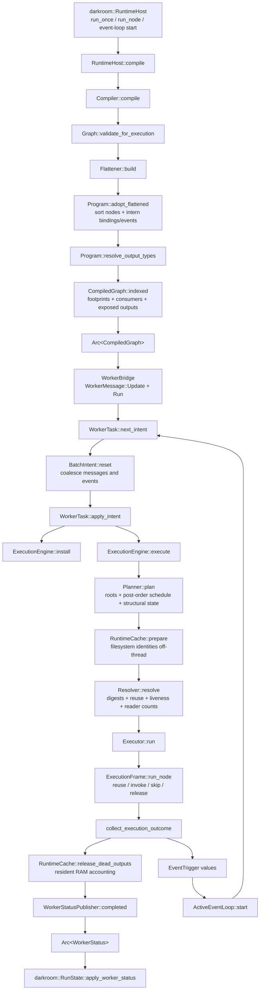
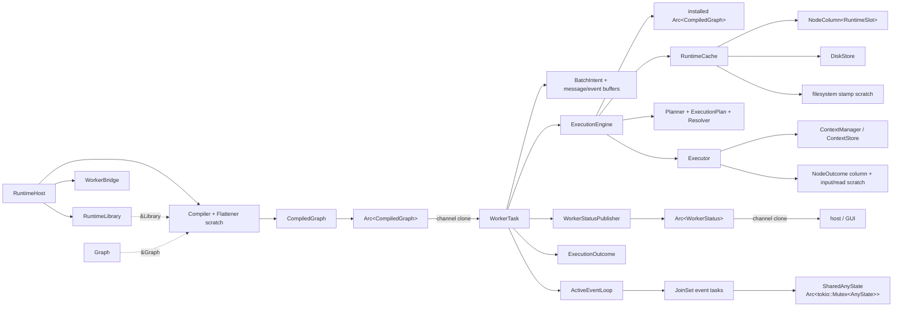

# Scenarium architecture and simplification analysis

Snapshot: `59ce8e50` (`Encapsulate runtime cache slot access`)

Scope: static source analysis of `scenarium`, with the `darkroom` host and GUI
consumers followed where they define the runtime boundary. This is a structural
call graph, ownership/borrowing analysis, and simplification review; it is not a
runtime profile.

## Executive assessment

Scenarium's central architecture is sound:

- authoring state is mutable and identity-rich;
- compilation produces an immutable, self-contained artifact;
- the worker exclusively owns mutable execution state;
- stable execution IDs are translated once into dense indices;
- hot per-run work uses typed, index-aligned columns instead of hash maps;
- shared ownership is confined to values that genuinely cross threads or
  outlive one borrow.

The main complexity is not excessive sharing. It is **phase state represented
by too many neighboring owners**, and **data normalized into one shape only to
be split and reassembled in later layers**.

The highest-value reductions are:

1. Make one object own the complete resolved run. Today `Planner`,
   `ExecutionPlan`, `Resolver`, `ResolvedOutputs`, and
   `RemainingOutputReads` divide one lifecycle across five types.
2. Carry one per-node result enum from executor to host. Today a coherent
   `NodeOutcome` is split into four vectors, rebuilt as potentially duplicate
   `NodeStatus` rows, then folded into the GUI again.
3. Normalize flatten attribution into the program's dense index space and
   discard the persistent ID-keyed `FlattenMap` builder representation.
4. Reuse compile-local authored type resolution rather than creating a fresh
   resolver for each type gate and then traversing output types again after
   flattening.

These changes preserve the strong parts of the current design. They do not
require new dependencies.

## End-to-end call graph



### Important call-path observations

- `RuntimeHost::compile` is the synchronization boundary between mutable editor
  state and runtime state (`darkroom/src/core/runtime_host.rs:137`). A failed
  compile never disturbs the worker.
- `Compiler::compile` performs validation, flattening, type resolution, and
  compile-artifact indexing in a strict sequence
  (`scenarium/src/execution/compile/mod.rs:316`).
- `BatchIntent` is a useful command reducer: graph/store/loop changes are
  last-write-wins while run roots, evictions, events, and sync replies are
  accumulated (`scenarium/src/worker/batch.rs:27`).
- The executor is not a recursive graph walker. It consumes the planner's
  dependency-first dense schedule and performs one turn per node
  (`scenarium/src/execution/executor/mod.rs:108`).
- Disk reuse deliberately has two stages: the resolver probes a header before
  it cuts an upstream cone, while the executor hydrates the value at the node's
  turn. Combining those blindly would either load too eagerly or make the cut
  unsound.

## Data flow

| Stage | Input | Output | Identity space | Mutation owner |
| --- | --- | --- | --- | --- |
| Authoring | `Graph`, `Library` | validated graph/library pair | `NodeId`, `GraphId`, port indices | editor/host |
| Flatten | nested graph definitions | flat nodes plus ID-based edge fixups and attribution | `ExecutionNodeId` | `Flattener` scratch |
| Program adoption | emitted nodes and fixups | sorted node/output pools and dense edges | stable ID at boundary, `NodeIdx`/`OutputIdx` inside | `Program` during compile |
| Compile indexing | `Program`, `FlattenMap` | immutable `CompiledGraph` query indices | both, with dense ranges internally | `Compiler` |
| Plan | run seeds and program | process order, roots, structural node states | dense | worker's engine |
| Resolve | plan and cache | refined node states, output demand, reader counts | dense | engine's resolver |
| Execute | resolved run and cache | cache mutations, per-node outcomes, event triggers | dense internally, stable IDs on reports | executor |
| Publish | `ExecutionOutcome` | immutable worker snapshot | `ExecutionNodeId` | worker status publisher |
| Attribute | worker snapshot and compiled graph | authored-node UI state | `ExecutionNodeId` to `NodeId` | host/GUI |

The stable-to-dense conversion is a particularly good boundary. Stable IDs
survive documents, installs, messages, and reports; dense indices exist only
inside one installed artifact. `Program::intern_bindings` pays the hash lookup
once (`scenarium/src/execution/program/mod.rs:193`), and all hot graph walks
afterwards use array reads.

## Ownership graph

Solid arrows mean ownership. Dashed arrows mean a temporary borrow or shared
view.



### Ownership conclusions

- `Arc<CompiledGraph>` is justified. The host needs the same immutable artifact
  for attribution while the worker installs and executes it.
- `Arc<WorkerStatus>` is also justified. It is an immutable cross-thread
  snapshot, and `WorkerStatusPublisher` already avoids deep cloning queued
  vectors with `Arc::get_mut` (`scenarium/src/worker/status.rs:78`).
- `RuntimeCache` is correctly single-owned by `ExecutionEngine`. Its private
  slot column is aligned to the installed program, and `reconcile` is the sole
  stable-ID remapping point (`scenarium/src/execution/cache/runtime/mod.rs:163`).
- `Arc<dyn CustomValue>` is part of value fan-out, not general runtime sharing.
  The last-reader path moves the value out of a non-RAM slot so
  `Arc::try_unwrap` can recover unique ownership.
- `SharedAnyState` is the one intentional interior-mutability island. Event
  lambdas are spawned tasks and genuinely need shared asynchronous access to
  the state initialized by a node.
- There is no broad `Arc<Mutex<Engine>>` or `RefCell` graph. `WorkerTask` owns
  the engine and serializes mutations, which keeps the cache, context store,
  plan, and outcome locally reasoned about.

## Borrow patterns

### Authoring graph

`Graph` exclusively owns nodes, sparse bindings, subscriptions, and local graph
definitions (`scenarium/src/graph/mod.rs:167`). `GraphDef` owns an interface and
body rather than dereferencing to a `Graph`, preventing whole-definition
operations from accidentally omitting the interface.

Boundary edits span two ownership regions: the owning graph's instance wiring
and the child definition's interface/body. The implementation first collects
instance IDs, then borrows the child mutably
(`scenarium/src/graph/boundary/mod.rs:143` and `:234`). That temporary `Vec` is
a normal borrow-splitting technique, not accidental copying. The mirrored input
and output implementations are, however, a code-reduction opportunity.

`DetachedNode`, `DetachedGraphInput`, and `DetachedGraphOutput` own everything
needed to reverse a mutation. This is appropriate ownership for undo/redo and
should not be replaced by borrowed snapshots.

### Flattening

`Flattener` owns reusable allocations. A short-lived `Run<'a>` borrows those
buffers plus `&Graph` and `&Library`, while `levels: Vec<&Graph>` tracks the
currently resolved nested bodies (`scenarium/src/execution/flatten/mod.rs:39`
and `:123`). This borrow bundle prevents borrowed graph references from leaking
into the long-lived compiler.

The bundle is useful, but `scope_stack: Vec<u32>` is redundant: only
`last/push/pop` are used, and recursive `emit_instance` already provides the
save/restore stack. A scalar current scope can replace that vector.

### Planning and execution

`ExecutionEngine::execute` serially lends the immutable program and mutually
exclusive mutable pieces to planner, cache preparation, resolver, and executor
(`scenarium/src/execution/engine/mod.rs:91`). This is a good no-lock pipeline,
but the state passed between phases is fragmented across owners.

`ExecutionFrame` packages the executor's many disjoint live borrows and gives
the reporter its own lifetime because mutable trait-object references are
invariant (`scenarium/src/execution/executor/mod.rs:175`). It is useful
borrow-checker structure. Shrinking its fields is worthwhile; removing it in
favor of closures, pervasive argument lists, or interior mutability is not.

### Cache and values

Cache mutation is intentionally sequential. The resolver stamps and probes;
the executor hydrates, invokes, consumes last readers, and stores; the engine
then releases dead values and measures RAM. `RuntimeCache` exposes individual
slots through `Index<NodeIdx>` while keeping column resizing private
(`scenarium/src/execution/cache/runtime/mod.rs:42`). That is the right ownership
boundary.

## Ranked simplifications

### 1. One owner for the complete resolved run

**Priority:** highest · **Risk:** medium, primarily borrow rewiring and tests ·
**Behavior change:** none

Current state is split as follows:

- `Planner` owns DFS `color` and `stack`
  (`scenarium/src/execution/plan/mod.rs:181`);
- `ExecutionPlan` owns schedule, node states, roots, node seeds, and event
  sources (`scenarium/src/execution/plan/mod.rs:117`);
- `Resolver` owns `ResolvedOutputs`, which owns output demand and initial reader
  counts (`scenarium/src/execution/resolve/mod.rs:29`);
- `Executor` clones reader counts into `RemainingOutputReads`
  (`scenarium/src/execution/executor/mod.rs:76`);
- `ExecutionEngine` permanently owns all three phase objects
  (`scenarium/src/execution/engine/mod.rs:40`).

They describe one run, are rebuilt together, and are invalid independently.
The module documentation already says structural planning and resolution are
passes rather than separate pieces of state; the ownership model should match
that statement.

Use one reusable `ExecutionPlan` (or `ResolvedRun`) owner containing:

```text
result:
  process_order
  node states
  roots / seeded / event sources
  output demand
  remaining output reads

private reusable scratch:
  DFS colors
  DFS stack
```

Expose structural planning and cache-aware refinement as separate private
methods so the algorithmic phases remain visible. Let the executor consume the
reader column in place after destructuring disjoint plan fields. The column is
reset on the next plan anyway, so cloning it into another owner has no semantic
value.

This removes `Planner`, `Resolver`, `ResolvedOutputs`, and
`RemainingOutputReads` as independent entities; removes the `resolver` field
from `RunRequest` and `ExecutionFrame`; removes one full output-column clone per
run; and makes “a run is ready for execution” one invariant owned in one place.

Do not merge `NodeState` with executor `NodeOutcome` as part of this first
change. Planned disposition is small and copyable; actual results carry errors
and timings. Combining those lifecycles is possible later, but it would make
the initial ownership reduction needlessly invasive.

### 2. Preserve one per-node result shape through reporting

**Priority:** high · **Risk:** medium-high because tests directly inspect the
current vectors · **Behavior change:** public worker-status shape changes

The executor already has the right model: one `NodeOutcome` enum per dense node
(`scenarium/src/execution/executor/outcomes.rs:11`). The data then takes this
round trip:

1. `collect_execution_outcome` splits it into `executed_nodes`,
   `cached_nodes`, `missing_inputs`, and `node_errors`;
2. `WorkerStatusPublisher::completed` drains those vectors back into
   `NodeStatus`;
3. a node that ran and failed receives two rows, RAM receives another row, and
   a node with several missing inputs receives repeated rows;
4. `darkroom::RunState::replace_results` folds those rows into authored-node
   state again (`darkroom/src/gui/run_state.rs:220`).

Carry a single crate-private per-node result enum in `ExecutionOutcome`, for
example:

```text
Cached
Executed { elapsed_secs }
MissingInputs { ports }
Errored { elapsed_secs: Option<f64>, error }
```

An errored node can retain whether its lambda ran without occupying both the
“executed” and “error” vectors. Missing port indices can stay attached if
engine diagnostics need them; the current worker status discards those indices
already.

Then make status payloads a sum type rather than
`WorkerStatus { kind, nodes, logs, cache_ram, ... }`:

```text
Activity
Patch { node progress }
Completed { summary, node results, node RAM, logs, cache RAM }
```

This removes `WorkerStatusKind` as a parallel discriminator, prevents invalid
combinations such as an activity update carrying completion fields, and lets
patch rows and completion rows have different concrete types instead of
`NodeStatus { status: Option<_>, ram: Option<_> }`
(`scenarium/src/worker/status.rs:36`).

Keep the `Arc<WorkerStatus>` snapshot and allocation-reuse strategy. Only the
payload schema needs to change.

### 3. Convert flatten attribution to dense form and discard the persistent builder map

**Priority:** high · **Risk:** medium · **Behavior change:** none

`Program` already owns both directions of the installed identity mapping:
`NodeIdx -> ExecutionNodeId` and `ExecutionNodeId -> NodeIdx`
(`scenarium/src/execution/program/mod.rs:113`). `FlattenMap` separately keeps a
`HashMap<ExecutionNodeId, Leaf>` for the full compiled graph lifetime
(`scenarium/src/execution/flatten/map.rs:17`).

`CompiledGraph::indexed` consumes the map to build dense footprints and exposed
producer ranges, but retains the original map solely for later attribution
(`scenarium/src/execution/compile/mod.rs:91`). A host attribution query therefore
hashes the same stable ID in a second stable-ID index.

At compile indexing:

1. use `program.e_node_index` to convert every leaf to a
   `NodeColumn<AttributionLeaf>`;
2. build footprints and exposed ranges as today;
3. move the scope parent table and dense leaf column into `CompiledGraph`;
4. discard the builder's leaf hash map and exposed pair vector.

`CompiledGraph::attribution(e_node_id)` then does one program ID lookup followed
by dense column and scope-parent reads. The temporary flatten record can remain
a builder type, but it should not be the installed representation.

This removes a persistent duplicate identity map, makes attribution obey the
same stable-at-boundary/dense-inside rule as execution, and narrows
`FlattenMap` from a runtime entity to compile scratch.

### 4. Reuse authored output-type resolution during compile

**Priority:** medium · **Risk:** medium because composite boundaries and drift
tolerance are subtle · **Behavior change:** none

Every `Graph::resolve_output_type` call creates a fresh
`OutputTypeResolver::new(0)` (`scenarium/src/graph/query.rs:149`). Flatten calls
that method for each bound input type gate and for composite boundary gates
(`scenarium/src/execution/flatten/mod.rs:498` and `:571`). Repeated wildcard
chains can therefore be traversed repeatedly during one compile.

After flattening, `Program::resolve_output_types` performs another memoized walk
over every flat output (`scenarium/src/execution/program/mod.rs:248`). The two
passes have different responsibilities—authored-edge acceptance versus final
runtime metadata—but they duplicate resolution work and can drift in their
treatment of equivalent paths.

First, introduce a compile-local resolver/cache for each authored graph and
have all flatten type gates query it. Then consider carrying the accepted
resolved output type into the emitted output metadata so the final program pass
only resolves cases that cross a flattened boundary.

Do not replace drift tolerance with eager rejection. A mismatched authored wire
intentionally flattens as unbound and can revive when library types line up
again.

### 5. Generalize the dense column implementation

**Priority:** medium-low · **Risk:** low · **Behavior change:** none

`OutputColumn<T>` and `NodeColumn<T>` duplicate the same `Vec<T>` wrapper,
`reset`, `From<Vec<_>>`, and typed indexing
(`scenarium/src/execution/program/index/mod.rs:23` and `:81`). Their additional
methods differ, but those can live on index-specific extension impls or a
shared generic.

Use a private `DenseColumn<I, T>` with aliases:

```text
type NodeColumn<T> = DenseColumn<NodeIdx, T>
type OutputColumn<T> = DenseColumn<OutputIdx, T>
```

A small private index trait can provide `idx()`. This retains the important
compile-time distinction between node and output indices while deleting the
parallel container implementations. It should remain private execution
infrastructure, not a new public abstraction.

### 6. Consolidate graph-boundary port transactions privately

**Priority:** medium-low · **Risk:** medium; avoid an over-generic public API ·
**Behavior change:** none

`graph/boundary/mod.rs` is 473 lines. Input and output port detach/attach flows
have the same transaction:

1. snapshot spec and both sides of wiring;
2. preflight the detached record;
3. shift instance and boundary slots;
4. restore wiring after the slot is reopened.

The direction of “binding key” versus “bound value” is mirrored, but the
transaction and validation structure are duplicated. Keep the public
`DetachedGraphInput` and `DetachedGraphOutput` types—they encode useful
directional type safety—but implement them through one private boundary-side
strategy or transaction helper.

The existing `instances: Vec<NodeId>` materialization should remain unless the
ownership layout itself changes. It is what permits mutation of a child graph
and its owner's instance wiring without interior mutability.

### 7. Remove small state and layering redundancies

**Priority:** low individually, suitable as isolated patches · **Risk:** low

- Replace `Flattener::scope_stack: Vec<u32>` with a scalar current scope saved
  and restored by recursive `emit_instance`
  (`scenarium/src/execution/flatten/mod.rs:39`).
- Keep only one `ExecutionOutcome::clear()`. It currently runs in
  `ExecutionEngine::execute` and again in `Executor::run`
  (`scenarium/src/execution/engine/mod.rs:98`,
  `scenarium/src/execution/executor/mod.rs:126`).
- Move event-task panic reporting out of the engine `Error` enum and into a
  worker-level error variant. `Error::EventLambdaPanic` is constructed only by
  `WorkerTask`, although `Error` is documented as the result type of engine
  operations (`scenarium/src/execution/error.rs:7`,
  `scenarium/src/worker/task.rs:291`).
- Remove the stale filesystem-identity sentence above the engine's `plan` field
  (`scenarium/src/execution/engine/mod.rs:46`).
- Replace stale execution documentation links to the removed `Disposition` and
  `NodeVerdict` types (`scenarium/src/execution/executor/mod.rs:12`,
  `scenarium/src/execution/plan/mod.rs:222`).

The last four are already recorded in `.notes/ISSUES.md`; a change that fixes
one should delete its issue entry.

### 8. Split and deduplicate the engine test module

**Priority:** maintenance · **Risk:** low if performed as a pure
move/deduplication · **Behavior change:** none

`scenarium/src/execution/engine/tests.rs` is 6,560 lines with 103 test
attributes and 21 existing domain modules. It duplicates local fixtures such
as `TempDir`, `disk_engine`, and `ran` in separate modules.

Move it to the sanctioned directory-module layout:

```text
execution/engine/tests/
  mod.rs
  cache_persistence.rs
  resources.rs
  planning.rs
  composites.rs
  execution.rs
  events.rs
  memory.rs
```

Put common fixtures in private parents at the narrowest useful scope and fold
similar graph setups into table-driven helpers. This will not simplify the
runtime, but it will make the runtime changes above materially safer and reduce
the largest concentration of repeated code in the crate.

## Simplifications not worth taking

- **Do not replace dense columns with ID-keyed maps.** The stable/dense split is
  one of the best architectural decisions in the crate.
- **Do not put the engine behind a mutex.** The worker already serializes
  commands and event batches; lock-based sharing would weaken ownership without
  removing a real constraint.
- **Do not remove `ExecutionFrame` or flatten's `Run` borrow bundle merely to
  reduce type count.** They make disjoint mutable borrows explicit. Shrink them
  as upstream entities disappear.
- **Do not merge disk probing and hydration without preserving the cache-aware
  cut invariant.** A verified frontier must exist before producers are pruned.
- **Do not replace `SharedAnyState` with unsynchronized ownership.** Event tasks
  truly overlap and share node state.
- **Do not make `Graph` implicitly cloneable or collapse detached undo records
  into references.** Identity remapping and exact mutation reversal are
  semantic ownership boundaries.
- **Do not flatten `CompiledGraph` into `Program` wholesale.** Host-facing
  authored attribution, footprints, exposed producers, and consumer closures
  are legitimate compile indices. Only their duplicate representations should
  be removed.

## Recommended sequence

1. Apply the isolated cleanup items: duplicate clear, event panic layering,
   stale comment, and scalar flatten scope.
2. Merge planner/resolver/output-reader ownership into one reusable resolved
   run. This improves the execution API before other refactors depend on it.
3. Normalize `ExecutionOutcome` and worker status around sum types and one
   per-node result stream.
4. Densify compile attribution and discard the persistent flatten builder map.
5. Add compile-local authored type memoization; measure whether carrying types
   through flatten makes the final program pass redundant.
6. Consolidate dense columns and boundary transactions if the resulting code
   is smaller at the call sites as well as in their defining modules.
7. Split the engine tests alongside whichever runtime change first requires
   broad fixture edits.

The first four steps target actual owner and data-shape reduction. The later
steps are worthwhile only if their private abstractions remain smaller than the
duplication they replace.
