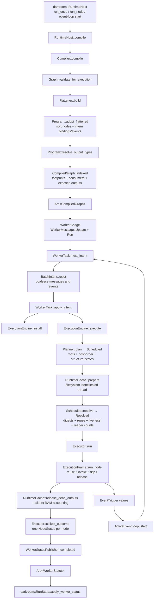
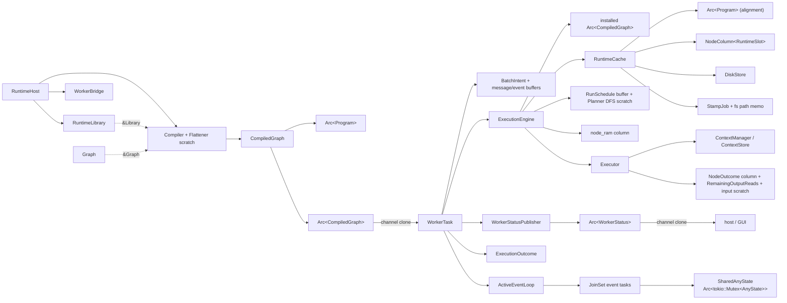

# Scenarium architecture and simplification analysis

Snapshot: `2da5975d` (`Refresh documentation and issue tracking notes`).
Re-verified against the source on 2026-07-29: every finding below was re-read
in the current code, landed ones were deleted, and line anchors are current.

Scope: static source analysis of `scenarium`, with the `darkroom` host and GUI
consumers followed where they define the runtime boundary. This is a structural
call graph, ownership/borrowing analysis, and simplification review; it is not a
runtime profile.

## Executive assessment

Scenarium's central architecture is sound:

- authoring state is mutable and identity-rich;
- compilation produces an immutable, self-contained artifact;
- the worker exclusively owns mutable execution state;
- stable execution IDs are translated once into dense indices;
- hot per-run work uses typed, index-aligned columns instead of hash maps;
- shared ownership is confined to values that genuinely cross threads or
  outlive one borrow.

The run pipeline is no longer the fragmented part. One `RunSchedule` buffer now
carries the whole derived run, two passes write it, and the `Scheduled` /
`Resolved` handles make phase order and program alignment compile-time facts
(`scenarium/src/execution/schedule/mod.rs:174`). The executor reduces its
per-node verdict column to exactly one `NodeStatus` per node, which the worker
publishes verbatim (`scenarium/src/execution/executor/mod.rs:191`).

What remains is concentrated in two places:

1. **Compile-time identity is still kept twice.** `CompiledGraph` retains the
   whole `FlattenMap`, including an `ExecutionNodeId`-keyed leaf map and an
   `exposed` vector already packed into the artifact's own index, so a host
   attribution query hashes a stable id in a second stable-id index.
2. **The published status payload is still a struct plus a discriminator.**
   `WorkerStatus { kind, nodes, logs, cache_ram }` permits combinations no
   producer emits, and the same `NodeStatus` type serves both live patches and
   completion rows with `Option` fields that mean different things in each.

Everything else is smaller: one duplicated compile-time type walk, one mirrored
authoring transaction, and a handful of isolated cleanups. None of it requires
new dependencies.

## End-to-end call graph



### Important call-path observations

- `RuntimeHost::compile` is the synchronization boundary between mutable editor
  state and runtime state (`darkroom/src/core/runtime_host.rs:137`). A failed
  compile never disturbs the worker.
- `Compiler::compile` performs validation, flattening, type resolution, and
  compile-artifact indexing in a strict sequence
  (`scenarium/src/execution/compile/mod.rs:535`).
- `BatchIntent` is a useful command reducer: graph/store/loop changes are
  last-write-wins while run roots, evictions, events, and sync replies are
  accumulated (`scenarium/src/worker/batch.rs:27`).
- The executor is not a recursive graph walker. It consumes the planner's
  dependency-first dense schedule and performs one turn per node
  (`scenarium/src/execution/executor/mod.rs:116`).
- Disk reuse deliberately has two stages: the resolve pass probes a blob header
  before it cuts an upstream cone, while the executor hydrates the value at the
  node's turn. Combining those blindly would either load too eagerly or make the
  cut unsound.
- The three run phases hand each other typed handles rather than the shared
  buffer, so executing an unresolved plan, resolving twice, or resolving against
  a different program than you execute against are all non-compiling programs
  (`scenarium/src/execution/schedule/mod.rs:493` and `:506`).

## Data flow

| Stage | Input | Output | Identity space | Mutation owner |
| --- | --- | --- | --- | --- |
| Authoring | `Graph`, `Library` | validated graph/library pair | `NodeId`, `GraphId`, port indices | editor/host |
| Flatten | nested graph definitions | flat nodes plus ID-based edge fixups and attribution | `ExecutionNodeId` | `Flattener` scratch |
| Program adoption | emitted nodes and fixups | sorted node/output pools and dense edges | stable ID at boundary, `NodeIdx`/`OutputIdx` inside | `Program` during compile |
| Compile indexing | `Program`, `FlattenMap` | immutable `CompiledGraph` query indices | both, with dense ranges internally | `Compiler` |
| Plan | run seeds and program | process order, roots, structural node states | dense | worker's engine |
| Resolve | plan and cache | refined node states, output demand, reader counts — same buffer | dense | the `Scheduled::resolve` pass |
| Execute | resolved run and cache | cache mutations, per-node verdicts, event triggers | dense internally | executor |
| Reduce | verdict column and node RAM | one `NodeStatus` per node | stable IDs on the rows | executor |
| Publish | `ExecutionOutcome` | immutable worker snapshot | `ExecutionNodeId` | worker status publisher |
| Attribute | worker snapshot and compiled graph | authored-node UI state | `ExecutionNodeId` to `NodeId` | host/GUI |

The stable-to-dense conversion is a particularly good boundary. Stable IDs
survive documents, installs, messages, and reports; dense indices exist only
inside one installed artifact. `Program::intern_bindings` pays the hash lookup
once (`scenarium/src/execution/program/mod.rs:196`), and all hot graph walks
afterwards use array reads. Compile-time *attribution* is the one relation that
still lives outside that rule — see item A1.

## Ownership graph

Solid arrows mean ownership. Dashed arrows mean a temporary borrow or shared
view.



### Ownership conclusions

- `Arc<CompiledGraph>` is justified. The host needs the same immutable artifact
  for attribution while the worker installs and executes it.
- `Arc<Program>` inside it is also justified, and is the better version of the
  same idea: `RuntimeCache` holds the program its slots are aligned to
  (`scenarium/src/execution/cache/runtime/mod.rs:46`), so "these indices mean
  something here" is a fact about the struct rather than a precondition every
  caller honours.
- `Arc<WorkerStatus>` is an immutable cross-thread snapshot, and
  `WorkerStatusPublisher` already avoids deep-cloning queued vectors by
  publishing into a fresh allocation when the previous one is still held
  (`scenarium/src/worker/status.rs:65`).
- `RuntimeCache` is correctly single-owned by `ExecutionEngine`. Its slot column
  is private, reached through `Index<NodeIdx>`, and `reconcile` is the sole
  stable-ID remapping point (`scenarium/src/execution/cache/runtime/mod.rs:101`
  and `:209`).
- `Arc<dyn CustomValue>` is part of value fan-out, not general runtime sharing.
  The last-reader path moves the value out of a non-RAM slot so
  `Arc::try_unwrap` can recover unique ownership.
- `SharedAnyState` is the one intentional interior-mutability island. Event
  lambdas are spawned tasks and genuinely need shared asynchronous access to
  the state initialized by a node.
- There is no broad `Arc<Mutex<Engine>>` or `RefCell` graph. `WorkerTask` owns
  the engine and serializes mutations, which keeps the cache, context store,
  schedule, and outcome locally reasoned about.

## Borrow patterns

### Authoring graph

`Graph` exclusively owns nodes, sparse bindings, subscriptions, and local graph
definitions (`scenarium/src/graph/mod.rs:167`). `GraphDef` owns an interface and
body rather than dereferencing to a `Graph`, preventing whole-definition
operations from accidentally omitting the interface.

Boundary edits span two ownership regions: the owning graph's instance wiring
and the child definition's interface/body. The implementation first collects
instance IDs, then borrows the child mutably
(`scenarium/src/graph/boundary/mod.rs:143` and `:234`). That temporary `Vec` is
a normal borrow-splitting technique, not accidental copying. The mirrored input
and output implementations are, however, a code-reduction opportunity (item C).

`DetachedNode`, `DetachedGraphInput`, and `DetachedGraphOutput` own everything
needed to reverse a mutation. This is appropriate ownership for undo/redo and
should not be replaced by borrowed snapshots.

### Flattening

`Flattener` owns reusable allocations. A short-lived `Run<'a>` borrows those
buffers plus `&Graph` and `&Library`, while `levels: Vec<&Graph>` tracks the
currently resolved nested bodies (`scenarium/src/execution/flatten/mod.rs:39`
and `:123`). This borrow bundle prevents borrowed graph references from leaking
into the long-lived compiler.

### Planning and execution

`ExecutionEngine::execute` serially lends the immutable program and mutually
exclusive mutable pieces to planner, cache preparation, resolve pass, and
executor (`scenarium/src/execution/engine/mod.rs:92`). Each phase consumes the
previous phase's handle, so that serial order is the only order that compiles.

`ExecutionFrame` packages the executor's many disjoint live borrows and gives
the reporter its own lifetime because mutable trait-object references are
invariant (`scenarium/src/execution/executor/mod.rs:286`). It is useful
borrow-checker structure; removing it in favor of closures, pervasive argument
lists, or interior mutability is not an improvement.

### Cache and values

Cache mutation is intentionally sequential. The resolve pass stamps and probes;
the executor hydrates, invokes, consumes last readers, and stores; the engine
then releases dead values and measures RAM. `RuntimeCache` exposes individual
slots through `Index<NodeIdx>` while keeping column resizing, the disk store,
and the path memo private. That is the right ownership boundary.

## Open simplifications

Ranked by impact; grouped so that items touching the same files travel
together.

### A. Compile-time identity and type resolution

Files: `execution/flatten/{mod.rs, map.rs}`, `execution/compile/mod.rs`,
`execution/program/mod.rs`, `graph/query.rs`.

#### A1. Densify flatten attribution and discard the persistent builder map

**Priority:** highest · **Risk:** medium · **Behavior change:** none

`Program` already owns both directions of the installed identity mapping:
`NodeIdx -> ExecutionNodeId` and `ExecutionNodeId -> NodeIdx`
(`scenarium/src/execution/program/mod.rs:114`). `FlattenMap` separately keeps a
`HashMap<ExecutionNodeId, Leaf>` for the full compiled-graph lifetime
(`scenarium/src/execution/flatten/map.rs:20`).

`CompiledGraph::indexed` consumes the map to build dense footprints and exposed
producer ranges, then stores the whole map anyway, solely for later attribution
(`scenarium/src/execution/compile/mod.rs:106` and `:165`). Two consequences: a
host attribution query hashes a stable id in a second stable-id index, and the
map's `exposed: Vec<(NodeId, ExecutionNodeId)>` stays resident after
`CompiledGraph::exposed` has already packed the same relation
(`scenarium/src/execution/flatten/map.rs:30`).

At compile indexing:

1. use `program.e_node_index` to convert every leaf to a
   `NodeColumn<AttributionLeaf>`;
2. build footprints and exposed ranges as today;
3. move the scope parent table and dense leaf column into `CompiledGraph`;
4. drop the builder's leaf hash map and exposed pair vector.

`CompiledGraph::attribution(e_node_id)` then does one program ID lookup followed
by dense column and scope-parent reads. The temporary flatten record can remain
a builder type, but it should not be the installed representation.

One thing to design for first: `CompiledGraphBuilder`
(`scenarium/src/execution/compile/mod.rs:596`, used by darkroom's `run_state`
tests) currently builds attribution over an *empty* `Program`. A dense leaf
column has no room for a leaf whose node the program does not contain, so the
builder must either mint stub program entries or the test fixture must move to a
real compile.

#### A2. Reuse authored output-type resolution during compile

**Priority:** medium · **Risk:** medium; composite boundaries and drift
tolerance are subtle · **Behavior change:** none

Every `Graph::resolve_output_type` call creates a fresh
`OutputTypeResolver::new(0)` (`scenarium/src/graph/query.rs:161`), and flatten
calls that method for each bound input type gate and for composite boundary
gates (`scenarium/src/execution/flatten/mod.rs:507` and `:579`). Repeated
wildcard chains are therefore traversed repeatedly during one compile — the
resolver's memo is thrown away between every call.

After flattening, `Program::resolve_output_types` performs another memoized walk
over every flat output (`scenarium/src/execution/program/mod.rs:253`, resolver
at `:281`). The two passes have different responsibilities — authored-edge
acceptance versus final runtime metadata — but they duplicate resolution work
and can drift in their treatment of equivalent paths.

First, introduce a compile-local resolver/cache per authored graph and have all
flatten type gates query it. Then consider carrying the accepted resolved output
type into the emitted output metadata so the final program pass only resolves
cases that cross a flattened boundary.

Do not replace drift tolerance with eager rejection. A mismatched authored wire
intentionally flattens as unbound and can revive when library types line up
again.

#### A3. Scalar flatten scope instead of a stack

**Priority:** low, isolated · **Risk:** low · **Behavior change:** none

`Flattener::scope_stack: Vec<u32>` uses only `last`/`push`/`pop`
(`scenarium/src/execution/flatten/mod.rs:43`, used at `:255`, `:302`–`:308`),
and recursive `emit_instance` already provides the save/restore stack. A scalar
current scope replaces it. Worth doing in passing by whoever touches A1 or A2.

### B. Host-facing run status

Files: `worker/status.rs`, `worker/task.rs`, plus darkroom's
`gui/run_state.rs`, `gui/app/mod.rs`, `core/worker.rs`,
`core/terminal_session/mod.rs`.

#### B1. Make the status payload a sum type

**Priority:** high · **Risk:** medium; public shape change with several host
call sites · **Behavior change:** public worker-status shape changes

The per-node half of this is done: the executor reduces its verdict column to
one `NodeStatus` per node (`scenarium/src/execution/executor/mod.rs:191`) and
the publisher appends those rows verbatim (`scenarium/src/worker/status.rs:106`).
The envelope around them was not changed:

```text
WorkerStatus { activity, kind: WorkerStatusKind, nodes, logs, cache_ram }
```

(`scenarium/src/worker/status.rs:33` and `:45`.) `kind` is a parallel
discriminator over fields that are only meaningful for one of its variants: an
`Activity` update carries three empty collections, and a `Patch` carries
`cache_ram: RamUsage::default()`. The row type is overloaded the same way —
`NodeStatus { status: Option<_>, ram }` is always `Some` status and zero RAM in
a patch, and possibly `None` status with real RAM in a completion snapshot
(`scenarium/src/execution/outcome.rs:49`).

Make the payload the sum:

```text
Activity
Patch { node progress }
Completed { summary, node results, node RAM, logs, cache RAM }
```

This removes `WorkerStatusKind`, prevents the invalid combinations above, and
lets patch rows and completion rows have different concrete types. Keep the
`Arc<WorkerStatus>` snapshot and the allocation-reuse strategy — only the
payload schema needs to change. Note that the completion summary fields are
genuinely read (`darkroom/src/core/terminal_session/mod.rs:83`,
`darkroom/src/gui/app/mod.rs:172`), so they move into the variant rather than
disappearing.

### C. Consolidate graph-boundary port transactions privately

Files: `graph/boundary/mod.rs`.

**Priority:** medium-low · **Risk:** medium; avoid an over-generic public API ·
**Behavior change:** none

`graph/boundary/mod.rs` is 473 lines. The input and output flows are mirrored
triples — `snapshot_graph_input`/`detach_graph_input`/`attach_graph_input`
(`:114`, `:143`, `:163`) against `snapshot_graph_output`/`detach_graph_output`/
`attach_graph_output` (`:205`, `:234`, `:253`) — over mirrored slot helpers
(`remove_input_slot`/`remove_output_slot`, `shift_binding_keys`/
`shift_bound_values`). Each triple runs the same transaction:

1. snapshot spec and both sides of wiring;
2. preflight the detached record;
3. shift instance and boundary slots;
4. restore wiring after the slot is reopened.

The direction of "binding key" versus "bound value" is mirrored, but the
transaction and validation structure are duplicated. Keep the public
`DetachedGraphInput` and `DetachedGraphOutput` types — they encode useful
directional type safety — but implement them through one private boundary-side
strategy or transaction helper.

The existing `instances: Vec<NodeId>` materialization should remain unless the
ownership layout itself changes. It is what permits mutation of a child graph
and its owner's instance wiring without interior mutability.

### D. Split and deduplicate the engine test module

Files: `execution/engine/tests.rs`.

**Priority:** maintenance · **Risk:** low as a pure move/deduplication ·
**Behavior change:** none

`scenarium/src/execution/engine/tests.rs` is 6,454 lines — the largest file in
the workspace — holding 55 tests across 21 domain modules. `TempDir`,
`disk_engine`, and `ran` are each defined twice, in the `cache_persistence`
(`:152`, `:176`, `:975`) and `resource_binds` (`:1950`, `:1969`, `:2114`)
modules.

Move it to the sanctioned directory-module layout:

```text
execution/engine/tests/
  mod.rs
  cache_persistence.rs
  resources.rs
  planning.rs
  composites.rs
  execution.rs
  events.rs
  memory.rs
```

Put common fixtures in private parents at the narrowest useful scope and fold
similar graph setups into table-driven helpers. This will not simplify the
runtime, but it makes the runtime changes above materially safer.

### E. Remaining small redundancies

Files: `execution/engine/mod.rs`, `execution/executor/mod.rs`,
`execution/program/index/mod.rs`.

- **Double outcome reset.** `outcome.clear()` runs in `ExecutionEngine::execute`
  (`scenarium/src/execution/engine/mod.rs:99`) and again at the top of
  `Executor::run` (`scenarium/src/execution/executor/mod.rs:131`). Keep one.
  Also recorded in `.notes/ISSUES.md`; a change that fixes it deletes that entry.
- **`RemainingOutputReads` is the last separately-owned piece of the resolved
  run.** The executor clones the resolved reader column into it once per run
  (`scenarium/src/execution/executor/mod.rs:79` and `:140`) purely to have a
  mutable copy. Consuming the column in place is no longer a cheap change: the
  executor takes `Resolved`, which is `Copy` precisely because both halves are
  shared borrows, and the engine reuses the same handle afterwards for
  `collect_outcome`. Weigh a `clone_from` of one `Vec<u32>` per run against
  giving up that handle's `Copy`-ness before touching this.
- **Dense column duplication has narrowed.** `OutputColumn<T>` and
  `NodeColumn<T>` (`scenarium/src/execution/program/index/mod.rs:26` and `:92`)
  now share only the `Vec<T>` field, `reset`, `len`, and typed indexing; their
  other methods have diverged (`slice`/`slice_mut` versus
  `push`/`get`/`iter_indexed`/`drain`). A private `DenseColumn<I, T>` with
  `NodeColumn`/`OutputColumn` aliases still deletes that overlap, but the win is
  now ~30 lines. Take it only alongside other work in this module.

## Simplifications not worth taking

- **Do not replace dense columns with ID-keyed maps.** The stable/dense split is
  one of the best architectural decisions in the crate.
- **Do not collapse the `Scheduled` / `Resolved` phase handles back into a
  shared buffer.** They are what makes phase order and program alignment
  compile-time facts rather than sequencing the engine must get right.
- **Do not put the engine behind a mutex.** The worker already serializes
  commands and event batches; lock-based sharing would weaken ownership without
  removing a real constraint.
- **Do not remove `ExecutionFrame` or flatten's `Run` borrow bundle merely to
  reduce type count.** They make disjoint mutable borrows explicit.
- **Do not merge disk probing and hydration without preserving the cache-aware
  cut invariant.** A verified frontier must exist before producers are pruned.
- **Do not replace `SharedAnyState` with unsynchronized ownership.** Event tasks
  truly overlap and share node state.
- **Do not make `Graph` implicitly cloneable or collapse detached undo records
  into references.** Identity remapping and exact mutation reversal are
  semantic ownership boundaries.
- **Do not flatten `CompiledGraph` into `Program` wholesale.** Host-facing
  authored attribution, footprints, exposed producers, and consumer closures are
  legitimate compile indices, and `Program` is now shared with the runtime cache
  as the alignment authority. Only duplicate representations should go (A1).

## Recommended sequence

1. Take the isolated cleanups whenever their files are open: the duplicate
   `clear` (E) and the scalar flatten scope (A3).
2. Densify compile attribution and drop the persistent flatten builder map
   (A1). Settle the `CompiledGraphBuilder` fixture question first.
3. Reshape the worker status payload into a sum type (B1). Independent of A, so
   the two can proceed in either order or in parallel.
4. Add compile-local authored type memoization (A2); then measure whether
   carrying types through flatten makes the final program pass redundant.
5. Consolidate boundary transactions (C) and the dense columns (E) only if the
   result is smaller at the call sites as well as in their defining modules.
6. Split the engine tests (D) alongside whichever runtime change first requires
   broad fixture edits.
