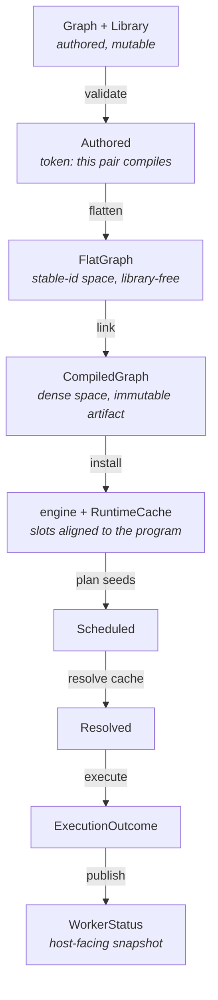

# Scenarium compile/execute pipeline — target design

A ground-up design for the path from authored graph to executed run, written as
the system *should* be rather than as it is. Grounded in the current code
(`2da5975d` plus the in-tree attribution work) but not constrained by it.

## The rule

**One stage, one value.** Every stage is a total function of the previous
stage's value plus at most one extra input. Its output is a type that can only
express what that stage knows, and every field of that type is final the moment
it exists.

Two corollaries, and they are the whole design:

- **A stage never writes into a later stage's type.** If flatten builds a
  `Program`, then `Program` has to be expressible half-built, and every later
  reader has to be trusted not to look too early.
- **A stage never leaves a field to be filled in later.** A field that means
  "not yet" needs a type that says so, or it belongs to a different stage's
  type.

Today's pipeline breaks both, in the same place and for the same reason: the
flatten walk streams into a `Program`, so between the walk and the end of
`Compiler::compile` the program exists in states nothing may observe —

- `ExecutionOutput { data_type }` holds `DataType::default()` until
  `resolve_output_types` runs (`execution/program/mod.rs:46`, `:253`);
- `ExecutionEvent { subscribers: Vec<NodeIdx> }` holds an empty subscriber list
  until `apply_subscriptions` (`:40`, `:214`);
- `ExecutionInput { binding }` holds `ExecutionBinding::None` for edges that
  *are* bound, until `intern_bindings` (`:32`, `:196`).

The third is the sharp one: an un-interned `Bind` is indistinguishable from an
unbound input. Nothing reads the program in that window today, but the types
permit it, and the window is real — `flattened.program` in `Compiler::compile`
has unresolved output types by construction.

Note what all three have in common: they are **dense-space fields created by
the stable-id stage**. `NodeIdx`, `OutputAddr` — flatten cannot know any of
them, so it writes the type's empty value and moves on.

## The pipeline



| Stage | In | Out | Identity space | What the type makes impossible |
| --- | --- | --- | --- | --- |
| validate | `&Graph`, `&Library` | `Authored<'a>` | authoring | flattening an unvalidated pair |
| flatten | `Authored<'a>` | `FlatGraph` | stable `ExecutionNodeId` | naming a dense index before one exists |
| link | `FlatGraph` | `CompiledGraph` | dense `NodeIdx`/`OutputIdx` | an un-interned edge, an unresolved output type, a program without its attribution |
| install | `Arc<CompiledGraph>` | engine state | dense | a cache whose slots don't match the program |
| plan | seeds | `Scheduled<'a>` | dense | executing a schedule nothing planned |
| resolve | `Scheduled`, cache | `Resolved<'a>` | dense | resolving twice; program/schedule mismatch |
| execute | `Resolved`, cache | `ExecutionOutcome` | dense in, stable out | a node reported twice |
| publish | `ExecutionOutcome` | `WorkerStatus` | stable | a status carrying fields its kind has no use for |

The last four rows are today's design and are the model the first three should
copy: `Scheduled` / `Resolved` already prove that a phase ran and that two
values belong together, by construction rather than by call order.

## Stage 1 — validate

```rust
/// A graph/library pair that `validate_for_execution` accepted: every func
/// reference resolves, every nested definition exists, nesting is within
/// depth. Minted only by validation, so a `&Authored` *is* the proof the
/// walk's infallible lookups rely on.
pub(crate) struct Authored<'a> {
    graph: &'a Graph,
    library: &'a Library,
}
```

Flatten is full of `expect("func resolved by validate_for_execution")`. Those
stay — they are logic errors — but the invariant gets a name and a single mint
point instead of living in eight comments. Same device as `Scheduled`, so it
costs one type and no runtime work.

*Optional.* It is the least valuable item here; take it only if the walk's
lookups keep growing.

## Stage 2 — flatten

Flatten's job: dissolve composites and boundary nodes, resolve edges across
them, and produce a flat func-only graph **in the stable-id space**, carrying
everything copied out of the library so nothing downstream needs it.

```rust
pub(super) struct FlatGraph {
    /// Emit order — the walk's order, not the program's. Ordering is link's.
    nodes: Vec<FlatNode>,
    /// Packed port pools. Node ranges index these, and ranges survive
    /// re-ordering the nodes, so link *moves* them into the program unchanged.
    inputs: Pool<FlatInput>,
    outputs: Pool<FlatOutput>,
    events: Pool<FlatEvent>,
    /// Edges, by id: a `Bind` can name a node the walk emits later.
    binds: Vec<PendingBind>,
    subscriptions: Vec<PendingSubscription>,
    /// Authored origin: one leaf per node, parallel to `nodes`, over the
    /// instance scopes the descent opened.
    scopes: Vec<Scope>,
    /// (instance, the node behind one of its exposed output ports) — not
    /// recoverable once the `GraphOutput` edges are gone.
    exposed: Vec<(NodeId, ExecutionNodeId)>,
}

struct FlatNode {
    id: ExecutionNodeId,
    leaf: Leaf,
    /// Topology and code, minus anything only link can know.
    node: FlatNodeData,
}
```

The three port types are where the "no placeholders" rule pays:

| Flat (stage 2) | Execution (stage 3) | Why they differ |
| --- | --- | --- |
| `FlatInput { required, stamps_fs_path, binding: FlatBinding }` where `FlatBinding = None \| Const(StaticValue)` | `ExecutionInput { …, binding: ExecutionBinding }` adding `Bind(OutputAddr)` | a bound edge is a `PendingBind` until link interns it — so "unbound" and "not yet interned" cannot be the same value |
| `FlatOutput { ty: FlatOutputType }` — `Fixed(DataType)` or `Wildcard { mirrors, mirrored_declared: DataType }` | `ExecutionOutput { data_type: DataType }` | flatten knows the *declaration*; link resolves it to the effective type |
| `FlatEvent { lambda }` | `ExecutionEvent { lambda, subscribers: Vec<NodeIdx> }` | subscribers are dense indices |

`FlatOutputType` carrying the mirrored input's declared type is what makes
**link library-free**: today `resolve_output_types` re-fetches each node's
`Func` from the library to read `func.outputs[i].ty` and
`func.inputs[mirrors].data_type` (`execution/program/mod.rs:256`–`:280`). With
the declaration recorded at flatten — where the func is already in hand — the
resolution pass needs only the flat graph and its interned edges. The library
stops being an argument to program construction, which is the property the
crate's docs already claim ("runtime digesting does not retain the function
library") but currently achieves by convention.

**Flatten never names `NodeIdx`, `OutputIdx`, `OutputAddr`, or `NodeColumn`.**
That is the test for whether this stage boundary is being respected.

## Stage 3 — link

One stage, one ordering decision, everything dense.

```rust
impl CompiledGraph {
    pub(crate) fn link(flat: FlatGraph) -> CompiledGraph
}
```

In order, all private to link:

1. **Order.** Sort `nodes` by id. A node's dense index is its position, so this
   single sort settles the program's node vector *and* the attribution column
   beside it — the leaves ride along in `FlatNode`, so they cannot drift.
   Determinism comes from the id sort, independent of walk order.
2. **Index.** Build `e_node_ids: NodeColumn<ExecutionNodeId>` and
   `e_node_index: HashMap<_, NodeIdx>` — the artifact's one stable-id index.
3. **Intern.** `PendingBind` → `ExecutionBinding::Bind(OutputAddr)`;
   `PendingSubscription` → subscriber lists. The pools move over unchanged
   except for these writes, which is the input pool's *first* value for a bound
   port rather than an overwrite.
4. **Resolve output types.** The wildcard fixpoint over interned edges, from
   `FlatOutput` into `ExecutionOutput`. Memoized per output as today; no
   library.
5. **Attribute.** `Attribution { scopes, leaves: NodeColumn<Leaf> }` — the
   leaves in the order step 1 fixed.
6. **Invert.** `footprints` (authored id → its execution nodes),
   `consumers` (reversed data edges), `exposed` (instance → its producer
   nodes), all packed into one `Pool<NodeIdx>`.

Steps 1–4 produce `Program`; 5–6 produce the host-facing half. They are one
stage because they share one ordering decision and because a `Program` without
its attribution answers no host question.

`Program` is then final and immutable for the life of the install, which is
what lets `Arc<Program>` be shared with `RuntimeCache` as the alignment
authority.

## Stages 4–8 — install, plan, resolve, execute, publish

Unchanged in shape; they are already the model. Recorded here so the pipeline
reads end to end:

- **install** — `RuntimeCache::reconcile` re-pairs slots to the new node set by
  stable id, and the cache holds the `Arc<Program>` its indices mean something
  in.
- **plan** — one backward DFS from the run's roots fills the reusable
  `RunSchedule` and issues `Scheduled`.
- **resolve** — stamps digests and sweeps for liveness/reuse/demand into the
  same buffer, consuming `Scheduled` and issuing `Resolved`.
- **execute** — walks the resolved schedule, then reduces its per-node verdict
  column to exactly one `NodeStatus` per node.
- **publish** — the one open gap: `WorkerStatus` should be a sum
  (`Activity | Patch | Completed`) rather than a struct plus a
  `WorkerStatusKind` discriminator. See item A1 in
  `.notes/scenarium-analysis.md`.

## What this changes, concretely

| Today | Target |
| --- | --- |
| `Flattener::flatten(root, library) -> Flattened { program, attribution, exposed }` | `Flattener::flatten(authored) -> FlatGraph` |
| `Program` built by the walk, mutated by three later passes | `Program` constructed once, inside link, already final |
| `Program::adopt_nodes` / `intern_bindings` / `apply_subscriptions` / `resolve_output_types` as `pub(crate)` mutators | private steps of `CompiledGraph::link`; `Program` has no mutators at all |
| `resolve_output_types(&mut self, library)` | resolution reads `FlatOutput`; no library |
| flatten builds `NodeColumn<Leaf>` (dense) | flatten builds `Vec<Leaf>` parallel to its nodes; link makes the column |
| `ExecutionOutput::default()` pushed as a placeholder | `FlatOutput` carries the declaration; no placeholder exists |

Costs, stated plainly:

- **Allocations.** Flatten's output buffers (`nodes`, `binds`, `subscriptions`,
  `scopes`, `exposed`) move into `FlatGraph` and cannot be reused across
  compiles; traversal scratch (`path`, `levels`, `scope_stack`, `seen_shared`)
  stays on the `Flattener`. That is ~5 vector allocations per compile, on a
  cold host-thread path that already clones a lambda handle per node. The
  **pools do not copy** — they move into the program, ranges intact.
- **One extra pass** over the output pool, converting `FlatOutput` →
  `ExecutionOutput`. It replaces a pass that did the same work *plus* a library
  lookup per node.
- **Churn.** `Program`'s three mutators and their direct unit tests move into
  link; the flatten tests gain the ability to assert on a `FlatGraph` without a
  program, which they currently cannot.

## What must not change

- **Streaming into packed pools.** The walk appending straight into the port
  pools, with nodes holding `PoolRange`s, is why no intermediate graph is
  materialized. `FlatGraph` owns those pools and hands them to the program by
  move — the split is a change of *ownership*, not of layout.
- **The stable/dense identity split**, and the rule that `NodeIdx` never enters
  a digest, a persisted byte, or a report.
- **Typed phase handles** for the run stages.
- **Drift tolerance.** A mismatched authored wire flattens as unbound and
  revives when the library lines up again; the pipeline must keep degrading
  rather than rejecting.
- **`Arc<CompiledGraph>` / `Arc<Program>` sharing** with the worker and cache.

## Migration order

Each step compiles and passes tests on its own; none needs the next.

1. **`FlatGraph` with today's port types.** Flatten stops taking a `Program`
   and returns its own value; `link` performs adopt/intern/subscribe/resolve as
   today, just moved. This alone removes the "flatten builds a Program"
   inversion the design note starts from.
2. **Split the port types** (`FlatInput`/`FlatOutput`/`FlatEvent`). Placeholders
   and the "unbound vs. un-interned" ambiguity disappear; `link` becomes
   library-free.
3. **Move attribution densification into link**, leaving flatten with
   `Vec<Leaf>` — removing the dense type from the stable-id stage.
4. **`Program` loses its mutators**, becoming construct-once. Its unit tests
   move to link.
5. *(Optional)* **`Authored` validation token.**
6. **`WorkerStatus` sum type** — independent of 1–5, and the largest remaining
   win on the run side.

Steps 1–2 are where the value is. Steps 3–4 are cleanup that only becomes
cheap once 1–2 have landed.
