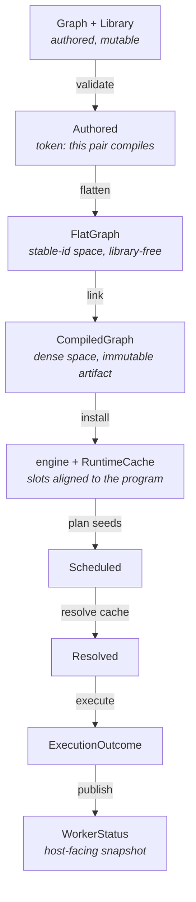

# Scenarium compile/execute pipeline — target design

The design of the path from authored graph to executed run. The compile side
(flatten → link) is built this way; the run side already was. What remains is
listed at the end.

## The rule

**One stage, one value.** Every stage is a total function of the previous
stage's value plus at most one extra input. Its output is a type that can only
express what that stage knows, and every field of that type is final the moment
it exists.

Two corollaries, and they are the whole design:

- **A stage never writes into a later stage's type.** If flatten builds a
  `Program`, then `Program` has to be expressible half-built, and every later
  reader has to be trusted not to look too early.
- **A stage never leaves a field to be filled in later.** A field that means
  "not yet" needs a type that says so, or it belongs to a different stage's
  type.

What the rule rules out, concretely. A pipeline where the walk streams into a
`Program` has to be able to express one half-built, and three of its fields end
up meaning "not yet":

- an output's `data_type`, until types are resolved;
- an event's subscriber list, until subscriptions are wired;
- an input's binding, until edges are interned — where "unbound" and "bound to
  a node not yet placed" become the same value, which is the sharp one.

All three are **dense-space fields created by the stable-id stage**: `NodeIdx`,
`OutputAddr` — the walk cannot know any of them, so it writes the type's empty
value and something later fills it in. Stage-local port types remove the
question: `FlatInput` has no `Bind(OutputAddr)` to leave empty.

## The pipeline



| Stage | In | Out | Identity space | What the type makes impossible |
| --- | --- | --- | --- | --- |
| validate | `&Graph`, `&Library` | `Authored<'a>` | authoring | flattening an unvalidated pair |
| flatten | `Authored<'a>` | `FlatGraph` | stable `ExecutionNodeId` | naming a dense index before one exists |
| link | `FlatGraph` | `CompiledGraph` | dense `NodeIdx`/`OutputIdx` | an un-interned edge, an unresolved output type, a program without its attribution |
| install | `Arc<CompiledGraph>` | engine state | dense | a cache whose slots don't match the program |
| plan | seeds | `Scheduled<'a>` | dense | executing a schedule nothing planned |
| resolve | `Scheduled`, cache | `Resolved<'a>` | dense | resolving twice; program/schedule mismatch |
| execute | `Resolved`, cache | `ExecutionOutcome` | dense in, stable out | a node reported twice |
| publish | `ExecutionOutcome` | `WorkerStatus` | stable | a status carrying fields its kind has no use for |

The last four rows are today's design and are the model the first three should
copy: `Scheduled` / `Resolved` already prove that a phase ran and that two
values belong together, by construction rather than by call order.

## Stage 1 — validate

```rust
/// A graph/library pair that `validate_for_execution` accepted: every func
/// reference resolves, every nested definition exists, nesting is within
/// depth. Minted only by validation, so a `&Authored` *is* the proof the
/// walk's infallible lookups rely on.
pub(crate) struct Authored<'a> {
    graph: &'a Graph,
    library: &'a Library,
}
```

Flatten is full of `expect("func resolved by validate_for_execution")`. Those
stay — they are logic errors — but the invariant gets a name and a single mint
point instead of living in eight comments. Same device as `Scheduled`, so it
costs one type and no runtime work.

*Optional.* It is the least valuable item here; take it only if the walk's
lookups keep growing.

## Stage 2 — flatten

Flatten's job: dissolve composites and boundary nodes, resolve edges across
them, and produce a flat func-only graph **in the stable-id space**, carrying
everything copied out of the library so nothing downstream needs it.

```rust
pub(super) struct FlatGraph {
    /// Emit order — the walk's order, not the program's. Ordering is link's.
    /// Each node carries the authored `Leaf` it came from, so the sort that
    /// places the nodes places the attribution with them.
    nodes: Vec<FlatNode>,
    /// Packed port pools. Node ranges index these, and ranges survive both the
    /// node sort and link's element-wise rebuild.
    inputs: Pool<FlatInput>,
    outputs: Pool<FlatOutput>,
    events: Pool<FlatEvent>,
    /// Event edges, by id — the one edge kind that needs a side list: the slot
    /// to write belongs to the *emitter*. A data edge goes straight into the
    /// consumer's own input slot, as `FlatBinding::Bind`.
    subscriptions: Vec<PendingSubscription>,
    /// The instance ancestry the leaves point into.
    scopes: ScopeTable,
    /// (instance, the node behind one of its exposed output ports) — not
    /// recoverable once the `GraphOutput` edges are gone.
    exposed: Vec<(NodeId, ExecutionNodeId)>,
}
```

The three port types are where the "no placeholders" rule pays:

| Flat (stage 2) | Execution (stage 3) | Why they differ |
| --- | --- | --- |
| `FlatInput { required, stamps_fs_path, binding: FlatBinding }` where `FlatBinding::Bind` names an `ExecutionOutputPort` | `ExecutionInput { …, binding: ExecutionBinding }` whose `Bind` is an `OutputAddr` | the edge lives in the slot it belongs to from the start, named by id until link addresses it — so "unbound" and "not yet interned" are different values, and there is no fixup list |
| `FlatOutput { ty: FlatOutputType }` — `Fixed(DataType)` or `Wildcard { mirrors, mirrored_declared: DataType }` | `ExecutionOutput { data_type: DataType }` | flatten knows the *declaration*; link resolves it to the effective type |
| `FlatEvent { lambda }` | `ExecutionEvent { lambda, subscribers: Vec<NodeIdx> }` | subscribers are dense indices |

`FlatOutput::Wildcard` carrying the mirrored input's declared type is what makes
**link library-free**: resolution would otherwise re-fetch each node's `Func` to
read `func.outputs[i].ty` and `func.inputs[mirrors].data_type`. Recorded at
flatten — where the func is already in hand — the resolution pass needs only the
flat graph and its interned edges, and `Program` never mentions a `Library` at
all. Self-containment becomes a fact about the types rather than a convention.

**Flatten never names `NodeIdx`, `OutputIdx`, `OutputAddr`, or `NodeColumn`.**
That is the test for whether this stage boundary is being respected.

## Stage 3 — link

One stage, one ordering decision, everything dense.

```rust
impl CompiledGraph {
    pub(crate) fn link(flat: FlatGraph) -> CompiledGraph
}
```

In order, all private to link:

1. **Order.** Sort `nodes` by id. A node's dense index is its position, so this
   single sort settles the program's node vector *and* the attribution column
   beside it — the leaves ride along in `FlatNode`, so they cannot drift.
   Determinism comes from the id sort, independent of walk order.
2. **Index.** Build `e_node_ids: NodeColumn<ExecutionNodeId>` and
   `e_node_index: HashMap<_, NodeIdx>` — the artifact's one stable-id index.
3. **Intern.** Rebuild the input pool, `FlatBinding::Bind(id)` becoming
   `ExecutionBinding::Bind(OutputAddr)` — each element's *first* value rather
   than an overwrite.
4. **Resolve output types.** The wildcard fixpoint over the edges just
   interned, rebuilding `FlatOutput` into `ExecutionOutput`. Memoized per
   output; no library.
5. **Wire.** Group `subscriptions` by emitter port, then build each
   `ExecutionEvent` with the subscriber list it ends up with — so an empty one
   means "nothing subscribes", not "not wired yet".
6. **Attribute.** `Attribution { scopes, leaves: NodeColumn<Leaf> }` — the
   leaves in the order step 1 fixed.
7. **Invert.** `footprints` (authored id → its execution nodes),
   `consumers` (reversed data edges), `exposed` (instance → its producer
   nodes), all packed into one `Pool<NodeIdx>`.

Steps 1–5 produce `Program`; 6–7 produce the host-facing half. They are one
stage because they share one ordering decision and because a `Program` without
its attribution answers no host question. `Attribution` is link's type, not
flatten's: the relation is the walk's, but the *placed* form belongs to the
stage that placed it — flatten keeps only the raw `Leaf` and `ScopeTable`
records it can actually produce.

`Program` is then final and immutable for the life of the install, which is
what lets `Arc<Program>` be shared with `RuntimeCache` as the alignment
authority.

## Stages 4–8 — install, plan, resolve, execute, publish

Unchanged in shape; they are already the model. Recorded here so the pipeline
reads end to end:

- **install** — `RuntimeCache::reconcile` re-pairs slots to the new node set by
  stable id, and the cache holds the `Arc<Program>` its indices mean something
  in.
- **plan** — one backward DFS from the run's roots fills the reusable
  `RunSchedule` and issues `Scheduled`.
- **resolve** — stamps digests and sweeps for liveness/reuse/demand into the
  same buffer, consuming `Scheduled` and issuing `Resolved`.
- **execute** — walks the resolved schedule, then reduces its per-node verdict
  column to exactly one `NodeStatus` per node.
- **publish** — the one open gap: `WorkerStatus` should be a sum
  (`Activity | Patch | Completed`) rather than a struct plus a
  `WorkerStatusKind` discriminator. See item A1 in
  `.notes/scenarium-analysis.md`.

## What it costs

- **Allocations.** Flatten's output buffers (`nodes`, `subscriptions`,
  `scopes`, `exposed`) move into `FlatGraph` and are not reused across compiles;
  traversal scratch (`path`, `levels`, `scope_stack`, `seen_shared`, the
  per-node input buffer) stays on the `Flattener`. That is ~4 vector
  allocations per compile, on a cold host-thread path that already clones a
  lambda handle per node — and it replaces the per-compile `Vec` the old
  adoption pass allocated to sort into.
- **Three element-wise pool rebuilds** at link, one per port kind: each moves
  its elements (no deep clone) into a pool of the program's type, positions
  preserved. The output one replaces a pass that did the same work *plus* a
  library lookup per node; the other two are the price of "unbound" and "not yet
  interned" being different values.

## What must not change

- **Streaming into packed pools.** The walk appending straight into the port
  pools, with nodes holding `PoolRange`s, is why no intermediate graph is
  materialized. `FlatGraph` owns those pools and linking rebuilds each into the
  program's element-for-element, positions preserved — so a node's ranges carry
  over unchanged (`PoolRange::retype`) and the layout is the same on both sides.
- **The stable/dense identity split**, and the rule that `NodeIdx` never enters
  a digest, a persisted byte, or a report.
- **Typed phase handles** for the run stages.
- **Drift tolerance.** A mismatched authored wire flattens as unbound and
  revives when the library lines up again; the pipeline must keep degrading
  rather than rejecting.
- **`Arc<CompiledGraph>` / `Arc<Program>` sharing** with the worker and cache.

## What is left

1. **`WorkerStatus` sum type** — the one stage whose output type still carries
   fields its kind has no use for. The largest remaining win, and independent of
   everything above. See item A1 in `.notes/scenarium-analysis.md`.
2. *(Optional)* **`Authored` validation token** — the least valuable item here;
   take it only if the walk's infallible lookups keep growing.
